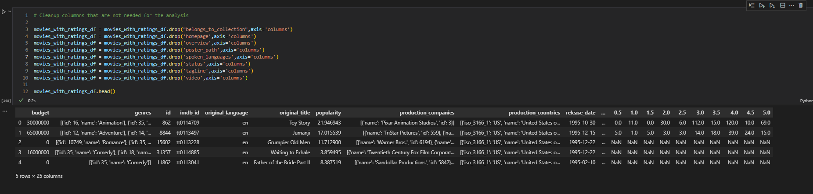
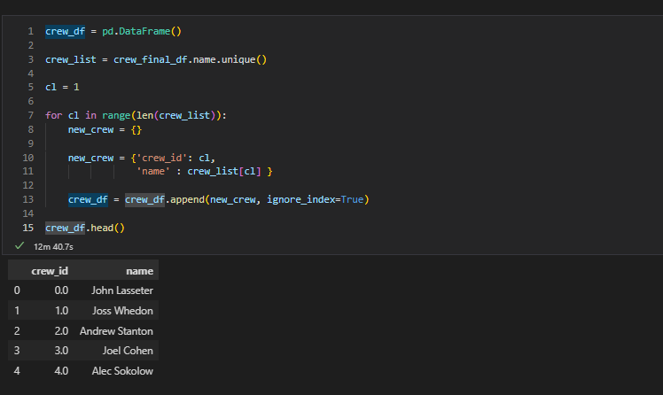

# Final-Project_Group-5
Final-Project_Group-5 Main repository for UofM Data Visualization &amp;amp; Analytics Boot Camp Final Project (Group 5), hosted by Max Schweikl, Stephanie Leonard, Randy Sendek, Lucas Bratland and Bailey Van Ommeren

## Communication Plan/Alignment
Our team was very specific around our schedules of availability over the course of this project.  The goal is to complete most or all deliverable work within alloted class hours, with the additional option for the team to meet/discuss ad-hoc outside of classroom hours as needed.  Slack will service as the primary and most crucial communication tool for all project work, including but not limited to link sharing, direct group messaging and formal huddle/Zoom meeting.  One critical component will be aligning to a role ownership each week.  While some team members have more comfortability/favorability of roles over others, we will still make sure each role has the support ownership needed to exceed, whether it's doubling up on some work or a team member owning a component role more than once if they're efficiently completing deliverables in that space.

## Project Topic
Our team all has an interest in various movie genres and love to watch both new films that are released as well as old films from prior years, and discuss our thoughts or opinions as to if we enjoyed the movie or not.  That being said, one area of curiosity is if one or more team member(s) likes a film, are they necessarily in the majority or not with others on the same opinions or views?  What exactly classifies a film as "successful" or "unsuccessful?"  What are the various input components of a film, such as cast/crew, producer, genre, production budget, release date and so on, that have the most influence on a film's success or not?  The question our group is looking to answer will be that of classification, in that for past released films, what input factors correlate the most with or drive the most success for a film, which we're defining as it's generated box office revenue producing at or more than double it's production budget.  From this, we can also hope to predict or infer on how successful future released films will be, based on prior trend of movies with similar production attributes.

## Dataset Chosen
At the moment, we will be utilizing a .csv dataset provided by the Kaggle, based on a dataset from the University of Minnesota that provides +26M movie review entries and a variety of different movie attributes, some of which were called out in the project topic headline above.  If this dataset is too large/overvalued, we will transition to an alternative option, which there are plenty available on the internet, most notably datasets accessed via IMDB.

The following datasets will be used:
- movies_metadata.csv
- credits.csv
- ratings.csv

Files were downloaded from [this linked Kaggle zip file](https://www.kaggle.com/rounakbanik/the-movies-dataset/download).

## Tools to Clean Data
Python and Pandas will be utilized to clean our dataset throughout the length of this project.

## Chosen Database
Currently our group is leaning towards utilizing a SQL/PostGres database with the raw data contents being extracted as a .csv file.

## Chosen Machine Learning Model
 We would like to use a regression ML model to understand which movie production factors lead to the highest revenue success, as well as which attributes are either not correlated/connected as strongly.  Being this is a categorization question, it may also be worth exploring if a decision tree model also makes the most sense for our analyis here too.

## Chosen Dashboard
Our team is currently considering utilizing matplotlib for our visualizations on this project, comparing various movie input components against their resulting revenue that was generated. 

## High Level Project Plan Diagram
Find below a high-level project plan diagram

 

# Data Analysis

## Data Source Selected
Our group selected to utilize the full Kaggel movie database which was first seen in module 8 of the bootcamp, dealing with ETL. We chose this data source for completeness, size, and variability. 

## Description of Source Data

These files contain metadata for all 45,000 movies listed in the Full MovieLens Dataset. The dataset consists of movies released on or before July 2017. Data points include cast, crew, plot keywords, budget, revenue, posters, release dates, languages, production companies, countries, TMDB vote counts and vote averages.

This dataset also has files containing 26 million ratings from 270,000 users for all 45,000 movies. Ratings are on a scale of 1-5 and have been obtained from the official GroupLens website.

## Content of Source Files
This dataset consists of the following files:

<table>
<tr>
<td>
movies_metadata.csv 
</td>
<td>The main Movies Metadata file. Contains information on 45,000 movies featured in the Full MovieLens dataset. 
The data is in the format:

<pre>
    index bigint,
    belongs_to_collection text,
    budget integer,
    genres text,
    homepage text,
    id bigint,
    imdb_id text,
    original_language text,
    original_title text
    overview text,
    popularity double precision,
    poster_path text,
    production_companies text,
    production_countries text,
    release_date timestamp without time zone,
    revenue double precision,
    runtime double precision,
    spoken_languages text,
    status text,
    tagline text,
    title text,
    video boolean,
    vote_average double precision,
    vote_count double precision,
</pre>

Genres are a pipe-separated list, and are selected from the following:
<ul>
<li>
Action
</li>
<li>
Adventure
</li>
<li>
Animation
</li>
<li>
Children's
</li>
<li>
Comedy
</li>
<li>
Crime
</li>
<li>
Documentary
</li>
<li>
Drama
</li>
<li>
Fantasy
</li>
<li>
Film-Noir
</li>
<li>
Horror
</li>
<li>
Musical
</li>
<li>
Mystery
</li>
<li>
Romance
</li>
<li>
Sci-Fi
</li>
<li>
Thriller
</li>
<li>
War
</li>
<li>
Western
</li>
<li>
(no genres listed)
</ul>

The vote average and vote count fields hold the reviews from TMDB, <a link="www.themoviedb.org">The movie DataBase</a>, for the film.
</td>
</tr>
<tr>
<td>
credits.csv: 
</td>
<td>
Each line of this file after the header row represents one movie. A movie record has the following format:

cast,crew,id

The Cast and Crew columns are a stringified JSON Object containing the appropriate list.

The id field is the movie id
</td>
</tr>
<tr>
<td>
ratings.csv
</td>
<td>
All ratings are contained in the file ratings.csv. Each line of this file after the header row represents one rating of one movie by one user, and has the following format:

userId,movieId,rating,timestamp

The lines within this file are ordered first by userId, then, within user, by movieId.

Ratings are made on a 5-star scale, with half-star increments (0.5 stars - 5.0 stars).

Timestamps represent seconds since midnight Coordinated Universal Time (UTC) of January 1, 1970.
</td>
</tr>
</table>

## Data Preparation

### Movie Metadata

The first file we read in was the movie_metadata.csv file. We need to do some ETL to prepare the data for analysis. This includes:

 - We drop all the adult movies, they are not included in this analysis.
 - We drop the adult column
 - We transform the budget column to a numeric
 - We transform the id column to a numeric
 - We transform the popularity column to a numeric
 - We transform the release_date column to a datetime

The next steps of data cleansing will include:
<ul>
<li>we have found a number of columns which won't be necessary for the analysis process. These columns will be dropped:</li>
<ul>
<li>Belong to Collection</li>
<li>Homepage</li>
<li>Overview</li>
<li>Poster</li>
<li>Spoken_Language</li>
<li>Status</li>
<li>Tagline</li>
<li>Video</li>
<li></li>
</ul>

### Ratings

The next file we read in is the ratings.csv file. The only ETL we needy to perform on this dataset is to set the timestamp to timestamp, to make sure we have an appropriate date for analysis.

### Credits

The last file we read in is the credits.csv file. This file needs the most extensive ETL to prepare the data for analysis.

The cast field of this file contains a string representation of a JSON object which is a list of dictionaries. Each dictionary in the list contains a cast members information.

The information contains things like:

- Movie ID
- Actor's Name
- Character Played  

An example would look like:

<pre>
[{'cast_id': 14, 'character': 'Woody (voice)', 'credit_id': '52fe4284c3a36847f8024f95', 'gender': 2, 'id': 31, 'name': 'Tom Hanks', 'order': 0, 'profile_path': '/pQFoyx7rp09CJTAb932F2g8Nlho.jpg'}, {'cast_id': 15, 'character': 'Buzz Lightyear (voice)', 'credit_id': '52fe4284c3a36847f8024f99', 'gender': 2, 'id': 12898, 'name': 'Tim Allen', 'order': 1, 'profile_path': '/uX2xVf6pMmPepxnvFWyBtjexzgY.jpg'}]
</pre>

The crew field of this file contains a string representation of a JSON object which is a list of dictionaries.  

The information contains things like:

- Movie ID
- Crew Member's Name
- Crew member's Department
- Crew members Job  

An example would look like:

<pre>
[{'credit_id': '52fe4284c3a36847f8024f49', 'department': 'Directing', 'gender': 2, 'id': 7879, 'job': 'Director', 'name': 'John Lasseter', 'profile_path': '/7EdqiNbr4FRjIhKHyPPdFfEEEFG.jpg'}, {'credit_id': '52fe4284c3a36847f8024f4f', 'department': 'Writing', 'gender': 2, 'id': 12891, 'job': 'Screenplay', 'name': 'Joss Whedon', 'profile_path': '/dTiVsuaTVTeGmvkhcyJvKp2A5kr.jpg'}]
</pre>

The ETL processing of this dataset involves the following steps:
<ol>
<li>Read the file into a dataframe</li>
<li>Set up a for loop to walk through the dataframe one record at a time</li>
<li>Set up a varibale which contains the string of the JSON object containing the list of cast for a movie</li>
<li>Utilize the literal_eval function to change a string into an actual JSON object</li>
<li>Set up a for loop to walk through the JSON object one dictionary at a time</li>
<li>Read the data out of the dictionary</li>
<li>append the read data in to a new dataframe for cast members</li>
<li>Set up a varibale which contains the string of the JSON object containing the list of crew for a movie</li>
<li>Utilize the literal_eval function to change a string into an actual JSON object</li>
<li>Set up a for loop to walk through the JSON object one dictionary at a time</li>
<li>Read the data out of the dictionary</li>
<li>append the read data in to a new dataframe for crew members</li>
</ol>

After the process runs, our final cast dataframe looks like:

After the process runs, our final crew dataframe looks like:

## Calculated Fields

## Ratings

Our data file for ratings, rating.csv, has 26,024,289 ratings for movies. The first set of calculated fields we want to do is to do counts of ratings by movie. 

This will allow us to add these values to the movies data, and not have to keep a ratings table in the database. 

# First pass at Database

Now that our data is ready, we can build the three tables we need

We have the following tables loaded and ready for further analysis:

<ul>
<li>Cast</li>
<li>Crew</li>
<li>The ratings table contains ratings for 7,567 movies. We will provide two version of the movie table:</li>
<ul>
<li>The original table with 45,454 movies with TMDB average scores and vote counts</li>
<li>The new table with 7,567 ratings based on a 5 star system from users of MovieLens.</li>
</ul>
</ul>

# Next Steps in Data Prep for Analysis

Now that we have the data in tables in the database, we can do the next stages of data analysis with SQL.

<ul>
<ul>
<li>Cast</li>
<ul>
<li>The cast list generated does not have unique identifiers for an actor. It has a movie id and a cast id which is unique for a person. But to search for all movies by a person, would take a search for the person's name in the movies table.</li>
<li>The cast list will have to processed down to a unique list of names.</li>
<li>Unique IDs will have to be assigned to be assigned to that list.</li>
<li></li>
<li>Then the new unique ids will have to be substituted into the cast table for the original cast_id.</li>
<li></li>
</ul>
<li>Crew</li>
<ul>
<li>The crew list generated does not have unique identifiers for a crew member. It has a movie id and a crew id which is unique for a person. But to search for all movies by a person, would take a search for the person's name in the movies table. </li>
<li>The crew list will have to processed down to a unique list of names. </li>
<li>Unique IDs will have to be assigned to be assigned to that list.</li>
<li></li>
<li>Then the new unique ids will have to be substituted into the crew table for the original crew_id.</li>
<li></li>
</ul>
<li>The ratings table contains ratings for 7,567 movies. We will provide two version of the movie table:</li>
<ul>
<li>The original table with 45,454 movies with TMDB average scores and vote counts</li>
<li>The new table with 7,567 ratings based on a 5 star system from users of MovieLens.</li>
<li>The final thing we will have to do to finalize the data for analysis is when the counts for ratings were calculated, there a number of columns with NULL as the value. We will have to replace those NULLs with zeros.</li>
<li></li>  
</ul>
<li>we have found a number of columns which look like JSON lists.</li>
<ul>
<li>Production Company</li>
<li>Genre</li>
</ul>
<li>These fields will have to to be processed to produce the following:</li>
<ul>
<li>A unique list of options for production company</li>
<li>A unique list of options for genre</li>
<li>Process the field to build a new table which contains a movieid and a production company id for each entry found in the data</li>
<li>Process the field to build a new table which contains a movieid and a genre id for each entry found in the data</li>
</ul>
</ul>

# Next Steps after Data Prep

Once the data is loading correctly into a PostgreSQL database on the local workstation, and we know that our ETL pipeline is functioning. We will migrate the database to a cloud based host so the rest of the team can access the prepared dataset.

